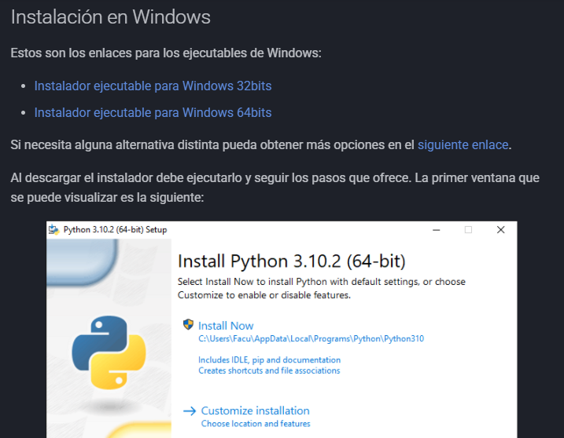
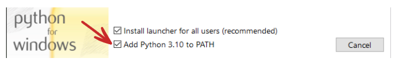
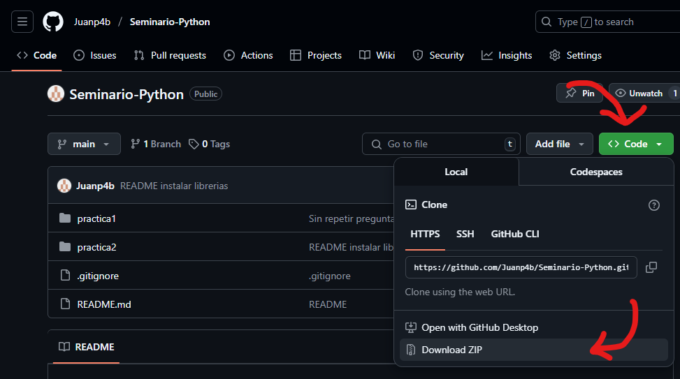
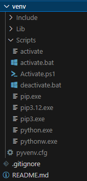
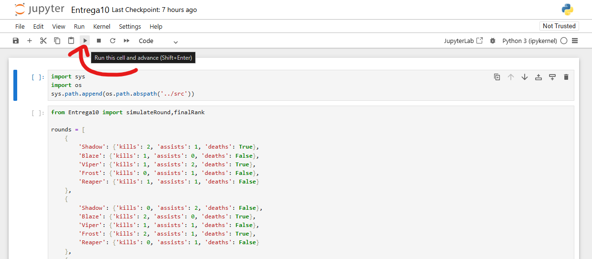

### AGNUSDEI Juan Pablo

## Descripción del Trabajo
- Entrega para Seminario de Lenguajes Opción Python.
- Resolución del Ejercicio 10 del Trabajo Práctico 2.
- Programado en Python (3.12.9) para ejecutarse desde Jupyter Notebook.

## INSTALAR PYTHON
1. Sigue los pasos de la siguiente documentación:
  - https://python-unlp.github.io/blog/2023/04/22/instalaci%C3%B3n-de-python/
2. Asegurese de descargar la version de Python 3.12.9.

3. Al momento de instalar, DEBE seleccionar la opción para agregar Python al PATH.

## DESCARGUE EL PROYECTO
1. Descargue el archivo ZIP del proyecto.

2. Extraiga el archivo descargado.
  - https://www.hostinger.com/es/tutoriales/descomprimir-archivos-zip

## CREAR ENTORNO VIRUAL
1. Abre la terminal (cmd).
2. Navega a la carpeta del proyecto.
  - Use el comando `cd <directorio>` para posicionarte.
  - Ejemplo: `cd C:/Seminario-Python`.
3. Sigue los pasos de la siguiente documentación:
- https://python-unlp.github.io/blog/2023/04/29/entornos-virtuales/
4. Al finalizar, deberías tener una carpeta "venv" en el proyecto.

## INSTALAR LIBRERÍAS NECESARIAS
1. En la terminal, navega a la carpeta donde se encuentra el archivo requirements.txt.
  - Use el comando `cd <directorio>` para posicionarte.
  - Ejemplo: `cd C:/Seminario-Python/practica2`.
2. Escribe el comando `pip install -r requirements.txt` y presiona Enter.

## EJECUTAR EL PROGRAMA
1. En la terminal, escriba `jupyter notebook` y presione Enter para iniciar el servidor de Jupyter Notebook.
  - Una vez iniciado, se debería abrir la interfaz automáticamente en el navegador web, si esto no ocurrió, abrir un navegador web e ingresar la siguiente url: `http://localhost:8888/` (por defecto el servidor se ejecuta utilizando el puerto 8888 de nuestra computadora).
2. Navega hacia el proyecto "Entrega10.ipynb".
  - Este se encuentra en: `Seminario-Python/practica2/notebooks/Entrega10.ipynb`
3. Ahora puede ejecutar el programa código por código presionando el botón ▶️"Run".

4. Para terminar la sesión del servidor basta simplemente con ir nuevamente a la terminal donde se ejecuto el comando anterior y presionar las teclas `CTRL` + `C`. La herramienta le pedirá una confimación y luego apagará el servidor.